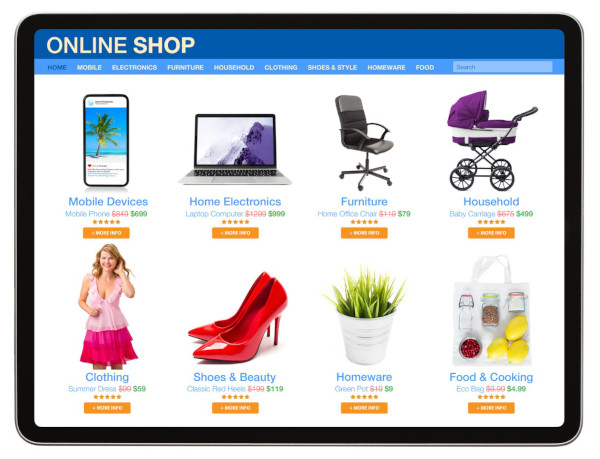
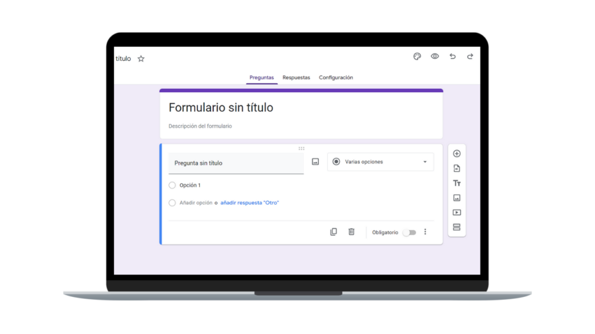

# Guía de usuario: Registro de un nuevo producto

## 1. Objetivo

### 1.1 ¿Qué permite realizar esta funcionalidad?
Esta funcionalidad permite a los usuarios administradores e inventariistas registrar un nuevo producto en el catálogo del sistema, asegurando que quede disponible de forma inmediata para el control de inventario y la emisión de ventas.

---

## 2. Información necesaria

Antes de iniciar el procedimiento, asegúrate de contar con los siguientes datos del producto:
* **Código de barras o SKU:** Identificador único del producto.
* **Nombre del producto:** Denominación clara y comercial.
* **Categoría:** Clasificación del producto (ej. *Bebidas*, *Abarrotes*, *Lácteos*).
* **Precio de venta:** Valor unitario en moneda local.
* **Stock inicial:** Cantidad física disponible en almacén.

---

## 3. Procedimiento

Sigue minuciosamente los pasos indicados a continuación para completar el registro:

### 3.1 Paso 1: Acceder al módulo de productos
Ingresa al menú lateral izquierdo de la plataforma, selecciona la opción **Inventario** y haz clic en **Registrar Producto**.



### 3.2 Paso 2: Completar el formulario
Rellena todos los campos obligatorios del formulario con la información del producto.



### 3.3 Paso 3: Guardar el registro
Verifica que los datos ingresados sean correctos y haz clic en el botón **Guardar Producto**. El sistema procesará la solicitud mediante la siguiente estructura de datos JSON:

```json
{
  "sku": "PROD-10293",
  "nombre": "Leche Entera 1L",
  "categoria_id": 4,
  "precio": 4.50,
  "stock_inicial": 50
}